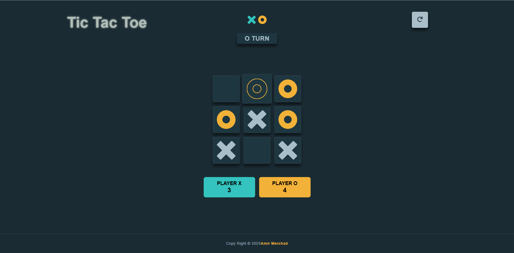

# ❌⭕ Tic Tac Toe Game

[](https://developer.mozilla.org/en-US/docs/Web/HTML)  
[](https://developer.mozilla.org/en-US/docs/Web/CSS)  
[](https://developer.mozilla.org/en-US/docs/Web/JavaScript)  
[](https://github.com/Amir-Merchad/tic-tac-toe/)

A stylish and responsive Tic Tac Toe game built with HTML, CSS, and JavaScript featuring smooth animations, multiple player modes, and dynamic score tracking. Designed and developed with a focus on modern CSS variables and UI polish.

Created as a personal project using [WebStorm](https://www.jetbrains.com/webstorm/) IDE.

---

## 📸 Screenshots

<p align="left">
  
</p>

---

## 🎮 Features

- Player modes:
    - Human vs Human
    - Human vs Computer
- Real-time score tracking for each player
- Smooth animations for moves and button interactions
- Responsive layout adapting from desktop to mobile
- Custom gradient animated title with dynamic glowing effect
- Modal dialog for initial game mode and player sign selection
- Reset button to restart the game at any time

---

## 🚀 Live Demo

[🔗 View Site](https://amir-merchad.github.io/Tic-Tac-Toe/)

---

## ⚙️ Technologies Used

| Tech         | Version | Notes                                                |
|--------------|---------|------------------------------------------------------|
| HTML         | 5       | Semantic layout with dialog and accessibility        |
| CSS          | 3       | CSS Grid, Flexbox, CSS Variables, animations         |
| JavaScript   | ES6     | Modular game logic, DOM manipulation, event handling |
| WebStorm     | 2025    | Primary development IDE                              |
| Git / GitHub | CLI     | Source control and repository hosting                |
| Chrome/Brave | 125+    | Development and debugging environment                |

---

## 📁 Project Structure

~~~plaintext
tic-tac-toe/
├── index.html
├── styles/
│   └── index.css
├── scripts/
│   └── script.js
├── assets/
│   ├── xo.svg
│   ├── x.svg
│   ├── o.svg
│   ├── empty.svg
│   ├── screenshot1.png
│   ├── screenshot2.png
│   └── screenshot3.png
└── README.md
~~~

---

## 🧠 What I Learned

- Implementing game logic for turn-based gameplay with JavaScript
- Using CSS variables and keyframe animations for modern UI effects
- Responsive design techniques with CSS Grid and Flexbox
- Handling user input and dynamic UI updates efficiently
- Using native `<dialog>` element for modal game setup
- Enhancing UX with smooth button press and hover animations
- Managing game state and scores cleanly in JavaScript

---

## 🧪 Run Locally

```bash
git clone https://github.com/Amir-Merchad/tic-tac-toe.git
cd tic-tac-toe
open index.html
